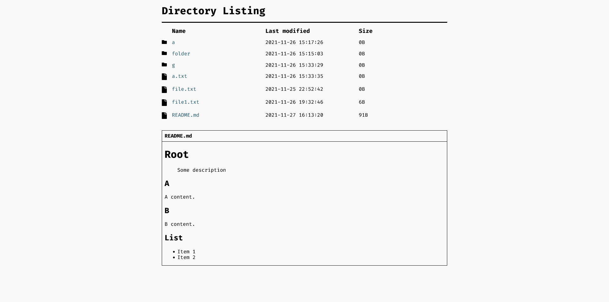

# Directory Listing

> Lists files and directories that exist in the `public` folder.

## Requirements

- Python 3.9+
- Pipenv

## Deployment

Read [Uvicorn Deployment](https://www.uvicorn.org/deployment/).

## Configuration

Create a `.env` file in the root of this project.

### Options

- DEBUG (bool): Toggle starlette debug mode. `Default: False`
- FAVICON (str): To add a favicon. `Default: None`
  - Note: The file must be in the `static` folder.
- HEADER (bool): Toogle header. `Default: True`
- CUSTOM_CSS (str, comma separated): Add one or multiple css file to the page. `Default: []`
  - Example: `CUSTOM_CSS = custom1.css, custom2.css`
  - Note: The file must be in the `static` folder.
- RENDER_README (bool): Render readme.md content. `Default: False`

## Icons

- Made by Font Awesome.
- [Font Awesome license](https://fontawesome.com/license)
- No changes were made.

## Unlicense

See [UNLICENSE](UNLICENSE) for details.
